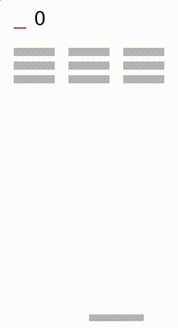
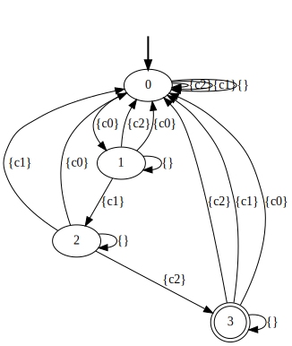
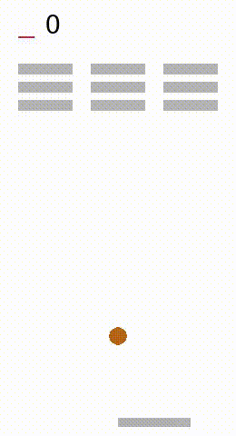
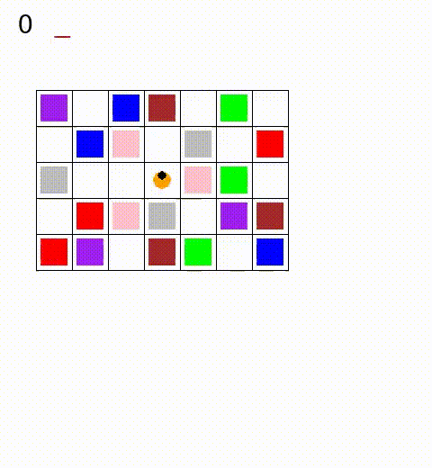
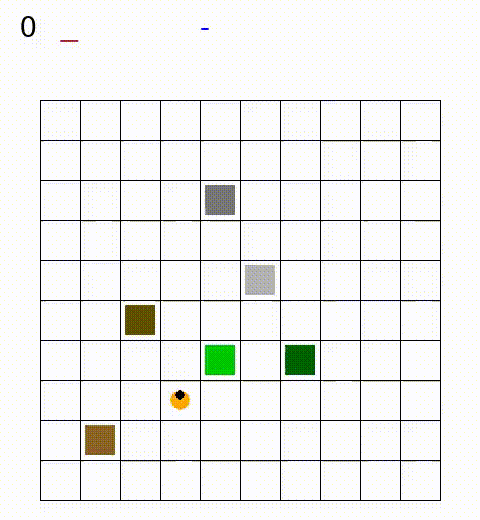
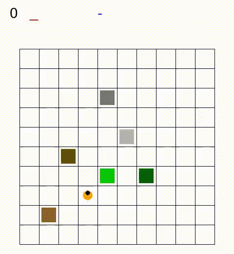

# Transfer Learning over Heterogeneous Agents with Restraining Bolts

For a more high-level description of the experiments, please
look at the [website](https://icaps2020submission-190.github.io/)

## Preliminaries

The code requires Python 3.7.

For dependency management, we use Pipenv. It can be installed with: 

    pip install pipenv 

Further details at the [official page](https://pipenv.readthedocs.io/en/latest/).

## Setup

- set your virtual environment up:

      pipenv --python=python3.7
      
- install the dependencies:

      pipenv install
      
- You might also need the following software:
    - `ffmpeg`: `sudo apt-get install ffmpeg`
    - `dot`: `sudo apt-get install graphviz`
 
## Directory structure:

- `rl_algorithm/`: contains the code that implements tabular
    RL algorithms 
    (e.g. 
    and   )
- `breakout`, `sapientino`, `minecraft`: contains the code for the experiments using the
    Breakout/Sapientino/Minecraft environment, the same used at [1]

Each experiment produces the following output:
- `expert/`: contains the model learned by the 'expert'
- `learner/`: contains the model learned by the 'learner'
- `positive_traces.txt`: a list of acceptable traces produced by the expert
- `negative_traces.txt`: a list of non-acceptable traces produced by the expert
- `true_automaton.svg`: the automaton used by the expert to learn the goal 
- `learned_automaton.svg`: the automaton learned from the positive/negative traces.

You can see some examples of runs of the experiments in the `examples/` folder. 

## How to run

Before running the scripts, be sure you followed the instructions
in [Preliminaries](#preliminaries) and [Setup](#setup).

Then:
- Activate the virtual environment in the current shell:

      pipenv shell
    
- Include the current directory in the `PYTHONPATH` variable:

      export PYTHONPATH=$(pwd):$PYTHONPATH  


### Breakout

 
The following command will launch the experiment with
Breakout (3 rows, 3 columns)

```
python3 -m breakout --rows 3 --cols 3
    --output-dir experiments/breakout-output
    --overwrite 
```

You'll find the output of the experiments in the folder 
`experiments/breakout-output/`.

This is the optimal policy learned by the expert agent:

<p align="center">
  
</p>

You can find examples of the produced traces in
[`positive_traces.txt`](./examples/breakout-output/positive_traces.txt) 
and [`negative_traces.txt`](./examples/breakout-output/negative_traces.txt) 


The learned automaton is:

<p align="center">
    
</p>

And this is the optimal policy learned by the learner agent. 


<p align="center">
  
</p>


### Sapientino

```
python -m sapientino --overwrite --output-dir experiments/sapientino-output
```

Expert: 

<p align="center">
  
</p>

Learner: 

<p align="center">
  
</p>


Check `examples/sapientino-output` for more information.

### Minecraft

```
python -m minecraft --overwrite --output-dir experiments/minecraft-output
```


Expert: 

<p align="center">
  
</p>

Learner: 

<p align="center">
  
</p>


Check `examples/minecraft-output` for more information.


## Implementation

The implementation of the experiments relies on the following projects:
- [Breakout Gym environment](https://github.com/sapienza-rl/gym-breakout-pygame): 
  a Breakout implementation in Pygame, with the OpenAI Gym interface.
- [Sapientino Gym environment](https://github.com/sapienza-rl/gym-sapientino): 
  a Gym environment inspired by the board game for kids Sapientino, implemented in Pygame.
- [Minecraft Gym environment](https://github.com/sapienza-rl/gym-minecraft-pygame): 
  a Gym grid environment inspired by Minecraft.
- [TempRL](https://github.com/sapienza-rl/temprl): implementation of
  the "Restraining Bolt" approach using the OpenAI Gym interface.
- [Pythomata](https://github.com/marcofavorito/pythomata/): a Python
  library to handle automata.

## References

- [1] De Giacomo, Giuseppe, et al. “Foundations for restraining bolts: Reinforcement learning with LTLf/LDLf restraining specifications.” Proceedings of the International Conference on Automated Planning and Scheduling. Vol. 29. No. 1. 2019.
